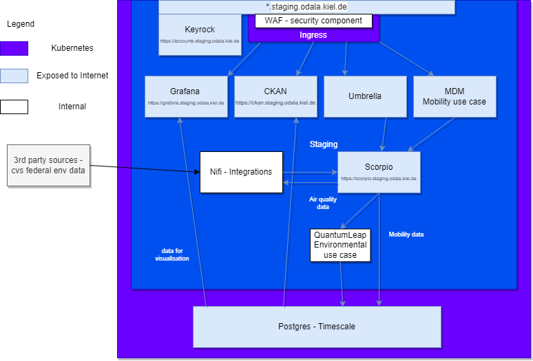
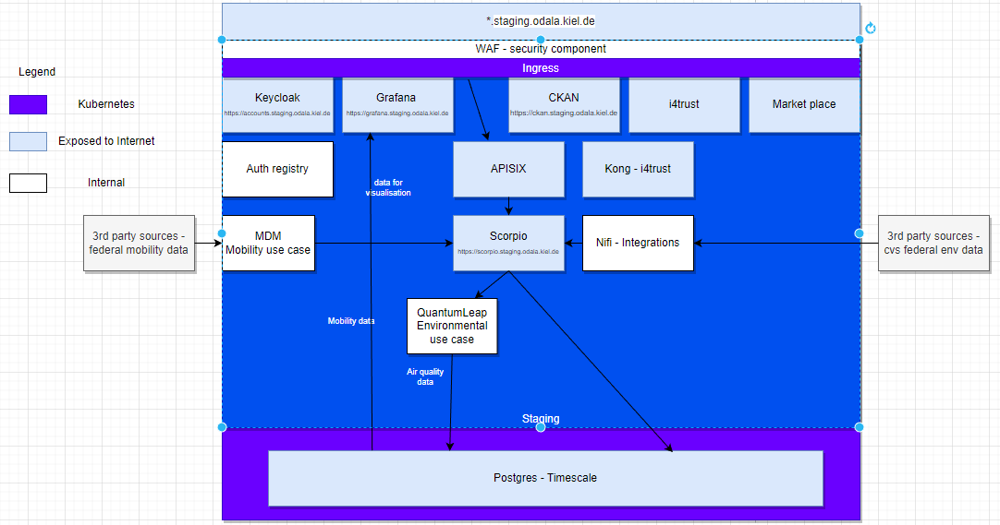

# ODALA Documentation

### Architecture

ODALA architecture has been evolving during the project duration and we have two major iterations. First one was deployed to front runner city Kiel during 1st half of 2022. Here is the architecture for that deployment:

Second iteration was developed due to various reasons; keeping technology relevant and emerging trend of Data Spaces:

This repository has components from the 1st iteration, and we will release here new iterations and components when they are mature enough. We will iterate the components and documentation with the follower cities, we get the best feedback from the people who need to deploy this into real world.

### Deployment model

Primarily, everything is organised under one Group in GitLab. There is no singel mono-repo, due to the fact that the follower cities need tailored deployment.

CI/CD pipeline deploys from branch containing "odala-production" branch to "odala-production" Namespace and a branch with text "odala-staging" deploys to "odala-staging" Namespace. Main branch does not deploy to anything.

Deployments take their secrets from the Groups CI/CD variables.

### Kubernetes requirements

Deployments assume that there is a storege class in the Kubernetes Cluster. It is also assumed that there is an Ingress. In the front runner city we have 3 Control nodes and 3 worker nodes with 4 CPU and 10 GB RAM each. All workers have 200 GB total.

### Per component documentation

Primarily, each of the components have their own documentation, with the exception of Access Control which is here under AccessControl folder. Otherwise, feel free to explore the Project list.

### Feedback.

You may open an Issue for the [Issue project](https://gitlab.publiccode.solutions/odala-public/issues), if you notice mistakes or want to contribute in any manner.

### About ODALA project

More information on the  [ODALA website.](https://odalaproject.eu/)

This Documentation mainly addresses project overall documentation. It contains architecture drawings, and other supporting documentation. 

There is a postman collection folder, which contains Postman collection(s) for accessing Scorpio.

Documentation for individual components reside otherwise in their respective projects.

[License EUPL 1.2](https://eupl.eu/1.2/en/)

The contents of this publication are the sole responsibility of the authors and do not necessarily reflect the opinion of the European Union.
This project has received funding from the European Union’s “The Connecting Europe Facility (CEF) in Telecom” programme under Grant Agreement number: INEA/CEF/ICT/A2019/2063604

